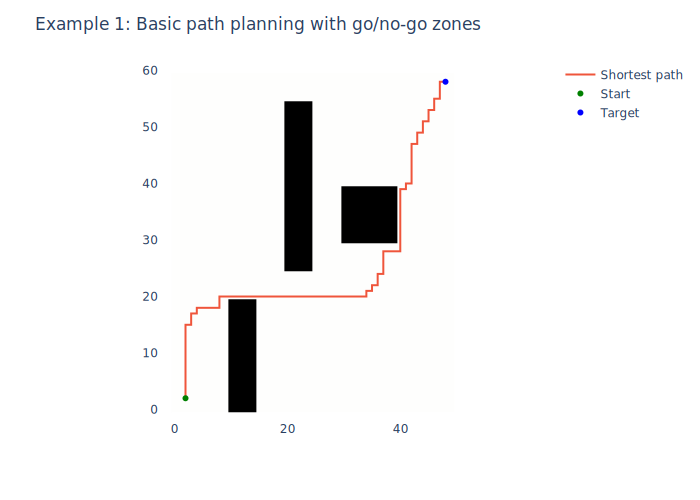
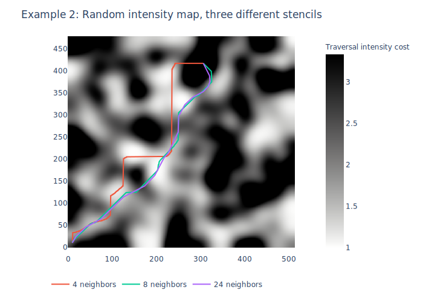

`gridijkstra` is a Python package for 2D grid-based path-planning

The package wraps scipy's dijkstra with a grid-oriented interface:

```python
>>> import gridijkstra
>>> import numpy as np
>>> np.random.seed(42)
>>> costs = np.random.uniform(1, 10, size=(100, 100))
>>> start = (2, 2)
>>> target = (98, 79)
>>> total_cost = gridijkstra.plan(costs, start, target)
>>> print(total_cost)
579.0969449851176
```

#### Installation

<pre>
pip install gridijkstra
</pre>

# Examples

See scripts/examples.ipynb for the code:






